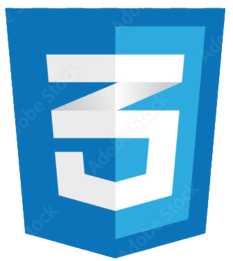
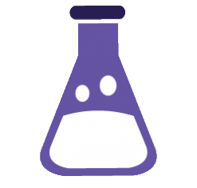
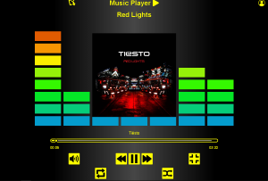

# 🔥Rvjonh💥

    

I'm a system engineer and self-taught web developer from Venezuela.
Github is a platform for software developers, where they can store their projects (known as repositories), to share them with people over the world. This is my account's repositories.

---

    Contact me:<a href="mailto:jonhvelasco3@gmail.com" target="blank">jonhvelasco3@gmail.com</a>

    
    
    

---

# Tech-Stack

    
    
    
    
    
    
    
    
    
    

    
    

---

## Small Projects

| PROJECT | DESCRIPTION | LINKS |
|---------|-------------|-------------|
|**Wordy** | A progressive web application which emulates exercises in apps like Duolingo, Memrise and others, helps users to practices and keep new vocabulary, the app uses web API's to work in different devices, allowing save the data and use them in multiple platforms. It's a full applications which allows user to create an account and manage dictionaries, which are sets of words or vocaburlary for the users to practice. |  |
|**Bookstore** | A bookstore website with full user 👨‍❤️‍👨 management and CRUD operations for 📘 Books with Reviews.👀 **It can take time to display (it's on render free tier)**|  |
|**To Do App** | Fullstack app with react, python and RESTfull app hosted and live. Add, Mark as done, Delete tasks, and control your activities with a "To Do App" like this. |  |
|**MusicPlayer:** | Play, pause, ship, and more functionabilities in my mediaplayer example. Created in javascript uses the Audio API to control songs. |  |

### Websites Examples - Ejemplos de paginas webs

|||||
|---|---|---|---|
|||||
